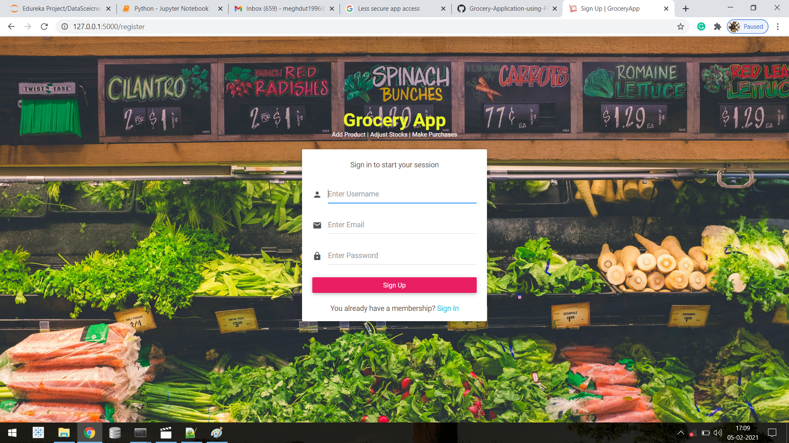

# Grocery-Application-using-Flask (https://simple-grocery-app.herokuapp.com/)

          
         

### Business Requirements:
1. Ability to login/logout
    a. Maintain by single user.
    b. Application entry point should be the login page.
    c. by default there should be a ready made admin page.

2. Ability to maintain product
    a. Add Product.
    b. List all product.
    c. Update product.
    d. Delete product.
    
    Fields:
    i.   id - unique
    ii.  code- unique string
    iii. name- string - 50 chars
    iv.  quantity - integer
    v.   create_at
    vi.  updated_at         

3. Ability to adjust stock
    
	a. show current quantity & let user enter new qunatity   
	b. Load all products & can update multiple lines    
	c. Can remove a product that has been added.
	d. Has apply button which saves the new qunaity to the product table
	e. Has save button which save current adjustment.
	f. Fields
		i.  id- unique
		ii. code- character
		iii. qunatity- integer

4. Ability to Purchase
	a. Show current quantity & let user enter qunatity to be purchased
	b. Can load all products
	c. Can remove a product that has been updated.
	d. Has Print to output list of product to be purhased
	e. Has Purchase button - stops the user from making further changes
	f. Has Receive button- make receive column updateable.
	g. Has Apply button- add the quantity purchased to te current stock
	Fields:-
		i. id
		ii. code
		iii. qunatity_pruchase
		iv. quantity_receive

###### Technical Requirements:-
	1. Frontend - adminbsb
	2. Backend - Flask
	3. Database - SQLITE
	4. Deployment - Heroku
